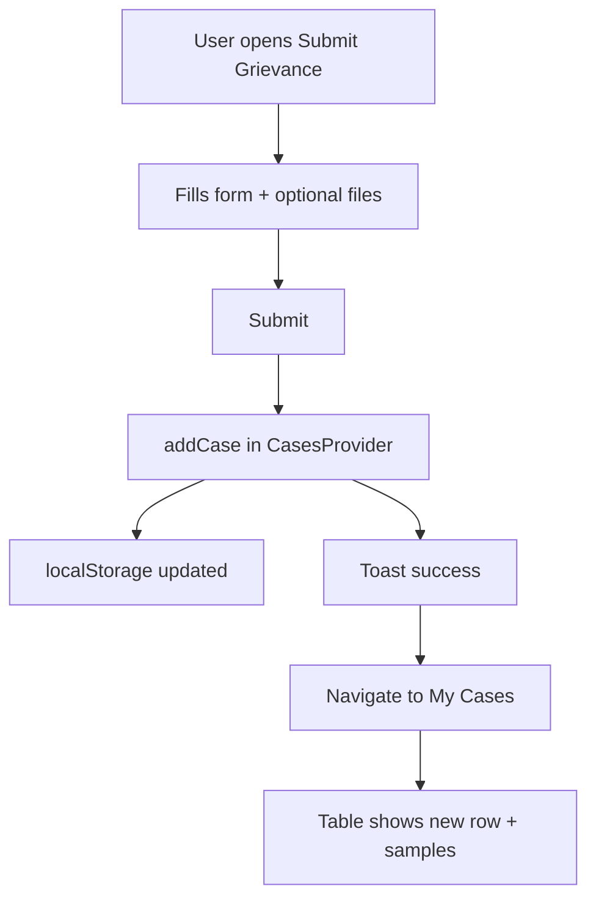
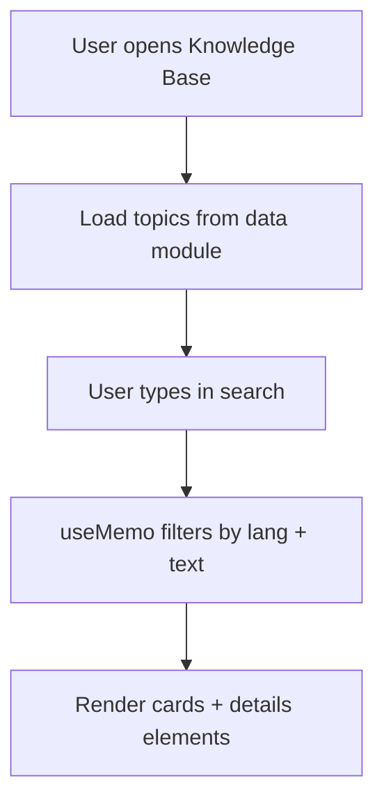
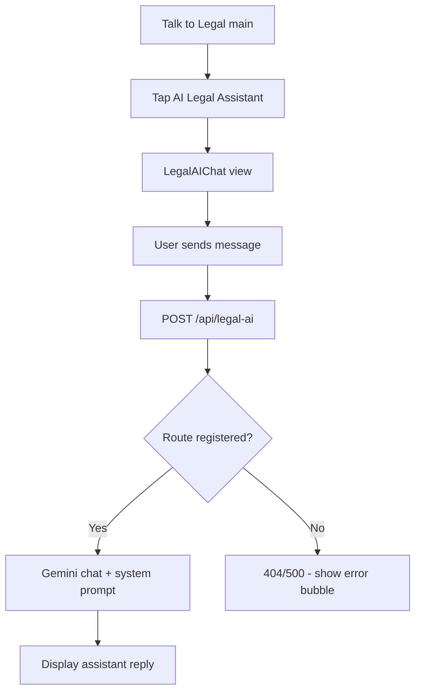

# Legal AID — Full-Stack Legal Access Web App

**Beginner → advanced guide** (resume, interviews, deep understanding)

> Based on the `legal_AID` repository: React SPA for legal information, grievance intake, and assistance flows. Where the codebase and deployment configs disagree, that is called out so you can speak honestly in interviews.

---


## Table of contents

1. [Project overview](#1--project-overview)
2. [Core idea](#2--core-idea-simple--technical)
3. [System architecture](#3--system-architecture)
4. [Tech stack breakdown](#4--tech-stack-breakdown-table)
5. [Folder and code structure](#5--folder-and-code-structure)
6. [Frontend ↔ backend connection](#6--frontend--backend-connection)
7. [Database](#7--database)
8. [Complete workflow](#8--complete-workflow)
9. [Important concepts](#9--important-concepts-used)
10. [Deployment](#10--deployment)
11. [Edge cases and challenges](#11--edge-cases-and-challenges-honest)
12. [Improvements and scalability](#12--improvements-and-scalability)
13. [Resume bullets](#13--resume-explanation-impact-style)
14. [Interview scripts](#14--interview-explanation)
15. [Interview Q&A](#15--interview-questions-with-answers)

---

## 1. Project overview

### What problem it tries to solve

Many people—especially in underserved or tribal-adjacent contexts—face barriers to **knowing their rights**, **finding where to get help**, and **recording a grievance** in a simple way. Legal AID is a **web application** that bundles:

- **Multilingual UI** (English, Telugu, Hindi) so the same information reaches more users.
- A **knowledge base** of legal topics (e.g. land rights, forest rights) with expandable sections and sources.
- A **grievance submission** flow that records cases **locally** (browser storage) and shows them in **My Cases** (alongside sample rows for demo).
- **Talk to Legal**: book-a-call (external link), **AI legal assistant** chat (intended to call an API), and **find legal aid** (geolocation + mock center list).

### Real-world analogy

Think of a **community legal kiosk**: one screen for “read the pamphlet,” another to “drop a complaint in the box,” and another to “ask a clerk (or a bot) a general question”—all in one website.

### Who would use it

- **End users** seeking general legal information and a way to log an issue.
- **Hackathon / NGO demos** showing how digital tools could extend legal literacy and intake.
- **Engineers** extending it with a real backend, auth, and a proper case-management API.

### Why it is useful

It lowers the **first step** cost: language choice, structured navigation, and offline-oriented thinking (e.g. offline forms page) support users who are not legal experts.

---

## 2. Core idea (simple → technical)

### Beginner explanation

The app is a **single-page website** built with **React**. When you click links, the browser does not reload the whole page; **React Router** swaps which “page” component is shown. Some data (like your list of submitted cases) is saved in the **browser’s local storage** so it persists after refresh. Parts of the app are ready to talk to a **server** using **`fetch`** and URLs starting with `/api/...`.

### Technical depth

- **SPA (Single Page Application):** One `index.html` shell; JS mounts React at `#root` and handles routing client-side (`BrowserRouter` + `Routes`).
- **State:**
  - **React Context** for i18n (`I18nProvider`) and cases (`CasesProvider`).
  - **localStorage** for language key and serialized case list.
- **Styling:** **Tailwind CSS** utility classes; **Radix-based** UI primitives under `client/components/ui/`.
- **Optional AI path:** `LegalAIChat` POSTs JSON to `/api/legal-ai`; a **handler exists** in `server/routes/legal-ai.ts` (Google Gemini) but **may not be registered** in `server/index.ts`—verify in repo; wire `app.post('/api/legal-ai', handleLegalAI)` if missing.
- **“Legal aid near me”:** Client uses **Geolocation API** when allowed; listing is **mock data** (comments in code say a real backend would map coords to centers).

---

## 3. System architecture

### High-level components

| Layer | Role in this project |
|--------|----------------------|
| **Browser (React)** | UI, routing, i18n, client state, `fetch('/api/...')` |
| **Static hosting** | Serves built HTML/JS/CSS (e.g. Vercel static build, or `dist`) |
| **API (optional)** | Express app (`createServer`) — exposes `/api/ping`, `/api/demo`; Netlify can wrap the same app as a serverless handler |
| **Database** | **No server database** in repo; cases live in **localStorage** only |

### ASCII architecture diagram

```
                    +-----------------------------+
                    |         User browser        |
                    |  React + React Router +     |
                    |  Context (i18n, cases)      |
                    +--------------+--------------+
                                   |
          +------------------------+------------------------+
          |                        |                        |
          v                        v                        v
   localStorage              Same origin              External services
   (lang, cases)            /api/* (if hosted         (Calendly, tel: links,
                            with API)                 Gemini when wired)
          |                        |
          |                        v
          |                 +-------------+
          |                 |  Express    |
          |                 |  (optional) |
          |                 +------+------+
          |                        |
          v                        v
   (no server DB)            Env: GEMINI_API_KEY
                             (for legal-ai handler)
```

### How they communicate

- **Navigation:** In-app links use React Router (`<Link>`, `<NavLink>`) — no full page reload for route changes.
- **API:** `fetch('/api/legal-ai', { method: 'POST', body: JSON... })` expects same-origin or proxied API in dev.
- **Persistence:** `CasesProvider` reads/writes `localStorage` key `cases.store.v1` on mount and when cases change.

---

## 4. Tech stack breakdown (table)

| Technology | Why it fits this project | Alternatives | Trade-offs |
|------------|---------------------------|--------------|------------|
| **React 18** | Component UI, large ecosystem | Vue, Svelte, Solid | More boilerplate; very hireable skill |
| **TypeScript** | Types for props, shared shapes | JavaScript only | Slightly slower to write; fewer runtime surprises |
| **Vite** | Fast dev server, modern ESM build | CRA, Webpack | Less “batteries included” than some older stacks |
| **React Router 6** | Declarative SPA routes | TanStack Router | Familiar pattern in interviews |
| **Tailwind CSS 3** | Rapid layout/styling | CSS Modules, styled-components | Class-heavy markup; great for prototypes |
| **Radix UI + shadcn-style components** | Accessible primitives (dialogs, etc.) | Headless UI, MUI | You compose styling yourself |
| **TanStack React Query** | Server/async state caching (configured in `App.tsx`) | SWR, plain fetch | Adds bundle size; powerful when many APIs exist |
| **Zod** | Runtime validation (dependency present) | Yup, Valibot | Great with forms/APIs when you use it |
| **Express 5** | Simple HTTP API for demos / serverless wrapper | Fastify, Hono | Minimal; you add structure yourself |
| **serverless-http** | Run Express on Netlify Functions | Native Netlify handlers | Cold starts; Express is heavier than a single function |
| **@google/generative-ai** | Gemini for chat-style replies | OpenAI API, Anthropic | API keys must stay server-side |
| **Framer Motion / Three.js** (deps) | Available for rich UI / 3D | — | Increases bundle if imported heavily |
| **Vitest** | Unit tests | Jest | Vite-native |

---

## 5. Folder and code structure

### Top-level mental model

```
legal_AID/
├── client/           # React SPA source
├── server/           # Express app (createServer)
├── shared/           # Types shared client/server (minimal today)
├── netlify/          # Netlify serverless entry
├── dist/ (after build)  # Typical Vite output (verify vs netlify.toml)
├── vite.config.ts    # Aliases @, @shared; base path for subpath hosting
└── vercel.json, netlify.toml  # Deploy configs
```

### Entry and routing

| File | Responsibility |
|------|----------------|
| `client/App.tsx` | Providers (`QueryClient`, `I18n`, `Cases`, `Tooltip`, toasts), `ErrorBoundary`, `BrowserRouter`, all routes |
| `index.html` | HTML shell; Vite injects client bundle |

### Pages (`client/pages/`)

| Page | Role |
|------|------|
| `Index.tsx` | Landing: pick language → `/home` |
| `Home.tsx` | Hub cards: knowledge, grievance, talk to legal, offline forms |
| `KnowledgeBase.tsx` | Search + expandable articles from data module |
| `SubmitGrievance.tsx` | Form → `addCase()` → toast → navigate to My Cases |
| `MyCases.tsx` | Table: user cases + hardcoded sample rows |
| `TalkToLegal.tsx` | View state machine: main / AI chat / legal aid |
| `OfflineForms.tsx`, `References.tsx`, `Dashboard.tsx` | Additional routes |
| `NotFound.tsx` | 404; unknown paths redirect to `/404` |

**Note:** If `KnowledgeBase.tsx` imports `@/data/knowledge_fixed` but only `knowledge.ts` exists, fix the import or add the file—build may fail until then.

### State and i18n

| Module | Functions / concepts |
|--------|----------------------|
| `client/state/cases.tsx` | `CasesProvider`, `useCases()`, `addCase`, `generateId`, `localStorage` sync |
| `client/i18n/index.tsx` | `I18nProvider`, `useI18n()`, `t(key)`, `setLang`, persists `app.lang` |
| `client/i18n/en.ts`, `te.ts`, `hi.ts` | String dictionaries |

**Note:** Confirm `I18nProvider` restores Hindi (`hi`) from `localStorage` if you support it—early state logic may need `stored === "hi"`.

### Notable components

| Component | Role |
|-----------|------|
| `Layout.tsx` | Header nav, footer, brand |
| `LegalAIChat.tsx` | Chat UI; `fetch('/api/legal-ai')`; maps last 10 messages to Gemini history shape |
| `LegalAidCenters.tsx` | Geolocation; mock centers; loading states |
| `TranslateButton.tsx` | Language switching UI |

### Server

| File | Role |
|------|------|
| `server/index.ts` | `createServer()`: CORS, JSON body, `/api/ping`, `/api/demo` |
| `server/routes/demo.ts` | Returns typed `DemoResponse` from `@shared/api` |
| `server/routes/legal-ai.ts` | `handleLegalAI`, `handleFindLegalAid` — ensure mounted in `index.ts` |
| `netlify/functions/api.ts` | `serverless(createServer())` |

### Shared types

| File | Role |
|------|------|
| `shared/api.ts` | `DemoResponse` interface (example of client/server contract) |

---

## 6. Frontend ↔ backend connection

### Request/response cycle (AI chat — intended)

1. User submits message in `LegalAIChat`.
2. Client appends user bubble to React state.
3. `fetch('/api/legal-ai', POST)` with `{ message, history }`.
4. Server calls Gemini with **system instruction** (disclaimer: not specific legal advice).
5. JSON response `{ response, history }` → assistant bubble.

### Data flow (ASCII)

```
[User types] --> React state (messages)
                    |
                    v
              fetch POST /api/legal-ai
                    |
                    v
         +----------+-----------+
         | Express (if mounted) |
         | + Gemini SDK         |
         +----------+-----------+
                    |
                    v
              JSON { response }
                    |
                    v
         React state update (new assistant msg)
```

### Dev vs production

- `vite.config.ts` may define a **proxy** for `/api`. Confirm how you run the API in development (same port vs separate); otherwise `/api/*` may 404.

---

## 7. Database

**There is no SQL/NoSQL database in this repository.**

| Concept | Implementation |
|---------|------------------|
| **Case storage** | `localStorage` JSON array under `cases.store.v1` |
| **Schema (logical)** | `CaseItem`: `id`, `issueType`, `description`, `submissionDate`, `status` |
| **Relationships** | N/A (single user, single browser profile) |

**Interview honesty:** Fine for a **prototype**; production needs **user accounts**, **server-side storage**, **audit logs**, and **PII protection**.

---

## 8. Complete workflow

### Flow A: Submit grievance



### Flow B: Knowledge base



### Flow C: Talk to Legal → AI chat



---

## 9. Important concepts used

- **SPA routing:** client-side paths without full reloads.
- **Context API:** global language and cases without prop drilling.
- **Controlled form state:** grievance form uses React `useState` / refs.
- **Persistence layer (browser):** `localStorage` + `useEffect` sync.
- **Composable UI:** Radix primitives + Tailwind (`cn` pattern).
- **Error boundaries:** `react-error-boundary` wraps the app.
- **Suspense:** loading fallback for async boundaries.
- **Internationalization pattern:** dictionary per language + `t(key)` function.
- **AI integration pattern:** server holds API key; client sends user text and bounded history (last 10 messages in `LegalAIChat`).

**Design patterns (interview vocabulary):**

- **Provider pattern** (Context).
- **Container / presentational** — loosely applied across pages vs layout/components.

---

## 10. Deployment

### Vercel (`vercel.json`)

- **Static build** (`@vercel/static-build`), `distDir: `dist`, SPA fallback to `index.html`.
- Add serverless functions separately if you need `/api` on Vercel without an external backend.

### Netlify (`netlify.toml` + `netlify/functions/api.ts`)

- **Build:** `npm install && npm run build`.
- **Publish folder:** Config may say `docs` while Vite outputs `dist` — **align** publish path with actual build output.
- **Redirects:** SPA `/*` → `index.html`; `/api/*` may point to a placeholder—replace with your real API or function URL.
- **Functions:** Express wrapped with `serverless-http` — confirm Netlify path rewrites to the function.

### Environment variables

| Variable | Purpose (from code) |
|----------|----------------------|
| `GEMINI_API_KEY` | Used in `server/routes/legal-ai.ts` when endpoint is active |
| `PING_MESSAGE` | Optional override for `/api/ping` message |
| `BASE_URL` / Vite `base` | `basename` for router; production base `/legal_AID/` in `vite.config.ts` for subpath hosting |

---

## 11. Edge cases and challenges (honest)

| Issue | What happens | Mitigation idea |
|--------|----------------|-----------------|
| **AI route not registered** | Chat `fetch` fails | `app.post('/api/legal-ai', handleLegalAI)` in `server/index.ts` + run API in dev |
| **Knowledge import path** | Build may fail | Import from `@/data/knowledge` or add missing module |
| **Hindi persistence** | May not restore from storage | Include `hi` in stored-lang check in `I18nProvider` |
| **File uploads** | Form lists file **names** only; files not uploaded | Add multipart API + object storage |
| **localStorage limits / privacy** | Cases visible on shared devices | Backend + auth + encryption |
| **Geolocation denied** | Fallback path in `LegalAidCenters` | Already handled |
| **Legal disclaimer** | AI must not be “advice” | System instruction + UI copy |
| **Deploy config drift** | `docs` vs `dist`, placeholder API URL | Single source of truth in CI |

---

## 12. Improvements and scalability

**Production-level checklist**

- **Backend:** PostgreSQL (or similar) for cases, users, roles, status workflow.
- **Auth:** OAuth or phone OTP; session management.
- **API design:** REST or tRPC; Zod schemas for request/validation.
- **File storage:** S3-compatible bucket; virus scan; signed URLs.
- **Observability:** logging, error tracking (Sentry), rate limits on AI endpoint.
- **Security:** never expose `GEMINI_API_KEY` to client; CSRF if cookies; CSP headers.
- **i18n at scale:** ICU messages, lazy-loaded locales.
- **PWA / offline:** service worker for true offline forms.
- **Search:** backend search or Algolia for large knowledge corpora.

**Scaling strategies**

- **Horizontal:** stateless API servers behind load balancer; DB read replicas.
- **AI:** queue long requests; cache FAQ answers; token budgeting.
- **CDN:** static assets on edge.

---

## 13. Resume explanation (impact-style)

Use metrics only if truthful (users, deploy URL, hackathon placement).

- **Built a multilingual (EN/TE/HI) React SPA** for legal literacy and grievance intake, with **client-side persistence** for submitted cases and a **structured knowledge base** with sourced legal topics.
- **Architected optional Express + serverless (Netlify) API layer** and integrated **Google Gemini**-style chat handler (server-side key) for **general legal information** with explicit non-advice guardrails in system prompts.
- **Implemented responsive UI** with **Tailwind CSS** and **accessible Radix-based components**, **React Router** navigation, and **React Query**-ready async infrastructure for future API expansion.

---

## 14. Interview explanation

### ~30 seconds

“Legal AID is a React TypeScript SPA that helps users learn about land and forest rights in multiple languages, submit grievances tracked in the browser, and explore paths to talk to legal help—including an AI assistant pattern that calls a server-side LLM API. It’s structured for static hosting with an optional Express API for demos and serverless deployment.”

### ~2 minutes

“I used React 18 with React Router for a multi-page feel without reloads. Global state is mostly Context: one provider for i18n with per-locale dictionaries, another for cases that serializes to localStorage so refreshes keep your submissions. The knowledge base is data-driven: we filter topics client-side by search string and current language. For ‘Talk to Legal,’ we have distinct UX paths: external scheduling, an AI chat component that posts JSON to `/api/legal-ai`, and a legal-aid finder that uses the browser geolocation API with mock results for the demo. On the server side, Express exposes demo endpoints, and there’s a Gemini integration module with a careful system prompt so the model gives general information, not personalized legal advice. If I were taking this to production, I’d add auth, a real database, secure file upload, and wire every deploy environment consistently.”

### Deep dive (if prompted)

Cover: **Context vs Redux**, **why localStorage is insufficient for PII**, **mounting POST `/api/legal-ai`**, **CORS**, **Netlify function cold starts**, **Vite `base` for GitHub Pages**, **manual chunks in Rollup**, **React Query defaults**, **prompt injection risk** on LLM endpoints (mitigate with policies, rate limits, logging).

---

## 15. Interview questions (with answers)

### Beginner

**Q: What is a SPA?**  
**A:** One HTML page; JavaScript handles navigation and updates the DOM. Faster transitions; needs correct server redirects for deep links.

**Q: What is React Context used for here?**  
**A:** Sharing language (`I18n`) and case list (`Cases`) across pages without passing props through every component.

**Q: What is localStorage?**  
**A:** Browser key-value storage (~5MB) that persists until cleared. Good for prototypes; not a secure server database.

### Intermediate

**Q: Why should the Gemini API key be on the server?**  
**A:** Anything in the client bundle can be extracted. Server-side keys stay secret; you can add rate limiting and abuse monitoring.

**Q: How does `LegalAIChat` limit context?**  
**A:** It sends only the **last 10** mapped messages as `history` to control tokens and cost.

**Q: What’s wrong with storing grievances only in localStorage?**  
**A:** No cross-device sync, no admin workflow, no backup, weak security on shared devices, and easy data loss if the user clears storage.

### Advanced

**Q: How would you deploy Express on Netlify cleanly?**  
**A:** Use a function with `serverless-http`, map `/api/*` to that function with redirects/rewrites, ensure cold start acceptable, and sometimes split critical routes into smaller functions.

**Q: How do you prevent the AI from giving unauthorized legal advice?**  
**A:** System instructions + UI disclaimers + refusal policies + escalate to human channels; still not perfect—log and monitor.

**Q: Why does `vite.config.ts` set `base: '/legal_AID/'` in production?**  
**A:** Hosting under a subpath (e.g. GitHub Pages project site) so asset URLs resolve correctly; Router `basename` should match.

---

## Quick visual analogy (learning curve vs depth)

```
Effort to understand
        ^
        |     +-- Gemini + serverless + deploy edge cases
        |   /
        | /          +-- React Router + Context + forms
        |/________________________> Depth of stack
```

---

## Mentor note

Pitch this as a **full-stack-aware frontend project** with **clear product intent** (access to justice, multilingual). In interviews, **credibility** comes from saying: *localStorage is a prototype choice*, *verify the AI route is registered and deploy paths match*, and *I’d add auth + DB for production*. That reads as **senior judgment**.

---

*Generated for the Legal AID project. Update sections as the codebase evolves.*

<!-- CHECKPOINT id="ckpt_mn704wuk_6ovm5l" time="2026-03-26T04:58:16.268Z" note="auto" fixes=0 questions=0 highlights=0 sections="" -->

<!-- CHECKPOINT id="ckpt_mn70hrto_smipko" time="2026-03-26T05:08:16.284Z" note="auto" fixes=0 questions=0 highlights=0 sections="" -->
